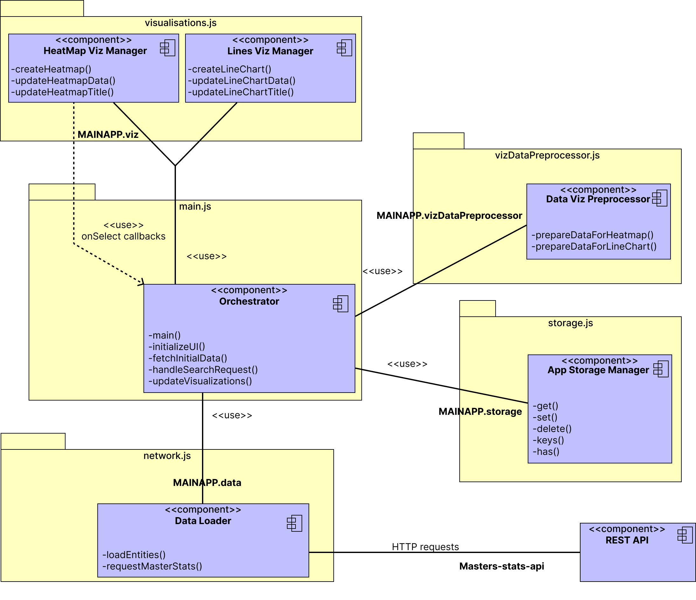

# sae3.01-3.03-groupe-4

### Diagramme de composants de l'application web

### Présentation technique de l'application NaMaster

#### **1. Introduction**
NaMaster est une application web conçue pour accompagner les étudiants dans leur recherche et sélection de masters. Elle propose une interface intuitive et des fonctionnalités avancées, telles que la visualisation de données, les avis utilisateurs, et la comparaison de formations. L’objectif est de centraliser toutes les informations pertinentes pour faciliter la prise de décision.

---

#### **2. Hébergement et environnement**
- **Serveur d'hébergement** : L’application sera hébergée sur la plateforme universitaire [https://perso.univ-lemans.fr/](https://perso.univ-lemans.fr/).
- **Base de données** : La base de données est gérée avec **PHPMyAdmin**, ce qui offre une interface web simplifiée pour la gestion des données MySQL.
- **Langages utilisés** :
  - **Frontend** : HTML, CSS (via Tailwind CSS), JavaScript.
  - **Backend** : PHP (compatible avec l'hébergement universitaire).
  - **Base de données** : MySQL.

---

#### **3. Architecture technique**
L’architecture est construite sur une approche modulaire, respectant les bonnes pratiques de développement web :
- **Frontend** :
  - Mobile-first design avec **Tailwind CSS**.
  - Scripts interactifs développés en **JavaScript**.
- **Backend** :
  - Gestion des requêtes et logique d’affaires en **PHP**.
  - Communication avec la base de données via PDO pour une sécurité renforcée.
- **Base de données** :
  - Structure relationnelle conçue avec MySQL.
  - Gestion via **PHPMyAdmin** pour simplifier les tâches d’administration et de maintenance.

---

#### **4. Fonctionnalités principales**
1. **Recherche de master** :
   - Système de recherche avancée par filtres (région, secteur, établissement, etc.).
2. **Visualisation des données** :
   - Graphiques interactifs (courbes et cartes de chaleur) générés via **ECharts**.
   - Comparaison des masters selon des critères précis (taux d’insertion, salaires, etc.).
3. **Avis utilisateurs** :
   - Consultation et ajout d'avis similaires à Google Reviews.
   - Classement des masters par retours d’expérience.
4. **Favoris** :
   - Possibilité de sauvegarder des masters ou des recherches pour un accès rapide.
5. **Profil utilisateur** :
   - Gestion des informations personnelles et des paramètres.
   - Suivi des candidatures en cours.
6. **Candidatures** :
   - Affichage des statistiques des candidatures pour chaque master.
   - Suivi des candidatures personnelles

---

#### **5. Déploiement**
- **Procédure** :
  - Déploiement initial via l'interface de gestion sur [perso.univ-lemans.fr](https://perso.univ-lemans.fr/).
  - Installation de la base de données sur le serveur MySQL intégré à l’hébergement.
  - Configuration des fichiers PHP pour pointer vers la base de données.
- **Structure des fichiers** :
  - **/assets/** : Contient les ressources front-end (CSS, JS, images).
  - **/php/** : Regroupe les scripts backend (logique métier, connexion BDD).
  - **/views/** : Fichiers HTML partiels pour les différentes pages.
  - **/database/** : Fichiers SQL pour l’initialisation des tables.

---

#### **7. Sécurité**
- Utilisation de requêtes préparées avec PDO pour éviter les injections SQL.
- HTTPS activé sur [perso.univ-lemans.fr](https://perso.univ-lemans.fr/) pour sécuriser les échanges.
